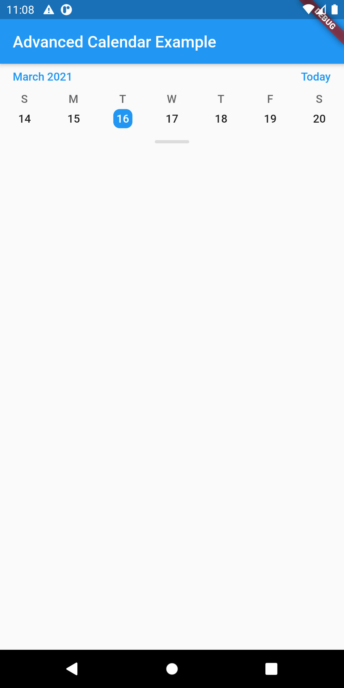
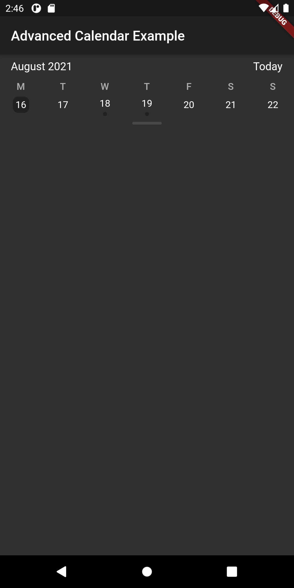
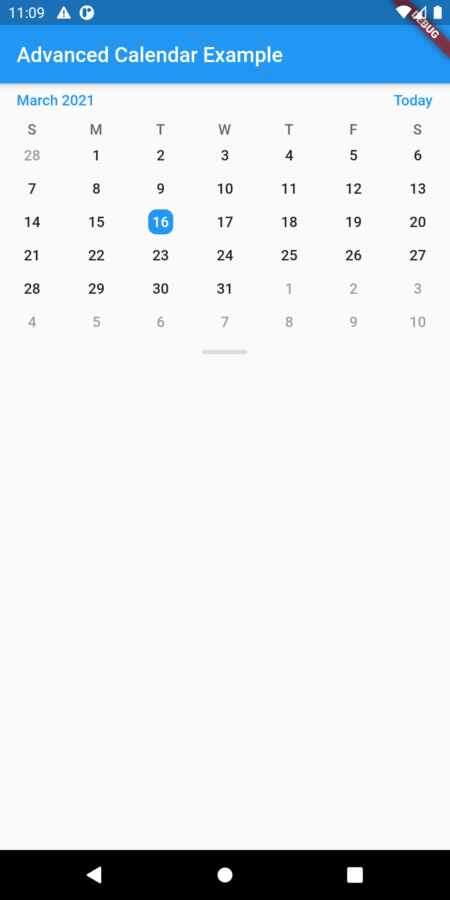

# flutter_advanced_calendar

An advanced calendar provides a rich API for widget customization that opens a new look and feel in your app.

## Advanced Calendar Theme LAF
| Advanced Calendar Light Theme | Advanced Calendar Dark Theme |
|:-:|:-:|
|  |  |
|  |  |


## Examples

Regular Calendar

```dart
final _controller = AdvancedCalendarController.today();
// ...
AdvancedCalendar(
    controller: _controller,
)
// ...
```

Custom Date Calendar

```dart
final _controller = AdvancedCalendarController.custom(DateTime(2021, 2, 15));
// ...
final theme = ThemeData.light();

Theme(
  data: theme.copyWith(
    textTheme: theme.textTheme.copyWith(
      subtitle1: Ttheme.textTheme.subtitle1.copyWith(
        fontSize: 16,
        color: theme.accentColor,
      ),
      bodyText1: theme.textTheme.bodyText1.copyWith(
        fontSize: 14,
        color: Colors.black54,
      ),
      bodyText2: theme.textTheme.bodyText1.copyWith(
        fontSize: 12,
        color: Colors.black87,
      ),
    ),
    primaryColor: Colors.red,
    highlightColor: Colors.yellow,
    disabledColor: Colors.green,
  ),
  child: AdvancedCalendar(
    controller: _calendarControllerCustom,
    weekLineHeight: 48.0,
  ),
),
// ...
```

## AdvancedCalendar Parameters
|Parameter|Description|Type|Default|
|:--------|:----------|:---|:------|
|`controller`|Controller that manage calendar state|*AdvancedCalendarController*|required|
|`weekLineHeight`|Height of week line|*double*|32.0|
|`preloadMonthViewAmount`|Amount of months in month view to preload|*int*|13|
|`preloadWeekViewAmount`|Amount of weeks in week view to preload|*int*|21|
|`weeksInMonthViewAmount`|Weeks lines amount in month view|*int*|6|
|`events`|List of DateTime to indicate date|*List<DateTime>*|[]|
|`startWeekDay`|Indicated for the beginning of the first day on Sunday|*int*|0|
|`innerDot`|Show alternative event design in date box|*bool*|false|

